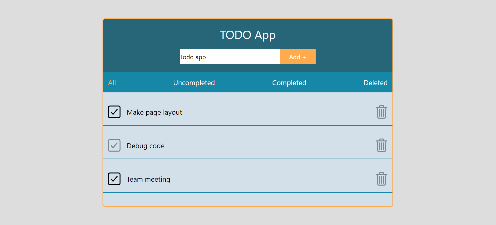
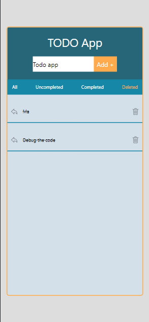

# ToDo App

ToDo list saved it in localStorage.

Includes:

1.  Page that allows create, delete and recover tasks.
2.  Filter to sort tasks by all, completed, uncompleted and deleted tasks.

# DEPLOYMENT

VERCEL: 

[LINK](https://todo-app-ten-bice.vercel.app/)

## Screenshots

Desktop version:

Mobile version:

## Libraries

1.  [REACT](https://en.reactjs.org/)
2.  [REACT ROUTER](https://reactrouter.com/)
3.  [TAILWIND CSS](https://tailwindcss.com/docs/guides/create-react-app)

## Install and run project

1. Clone repo.
2. Install modules `npm install`.
3. Setting up Tailwind CSS (check documentation link).
4. Run project `npm start`.
